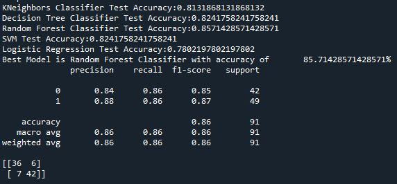
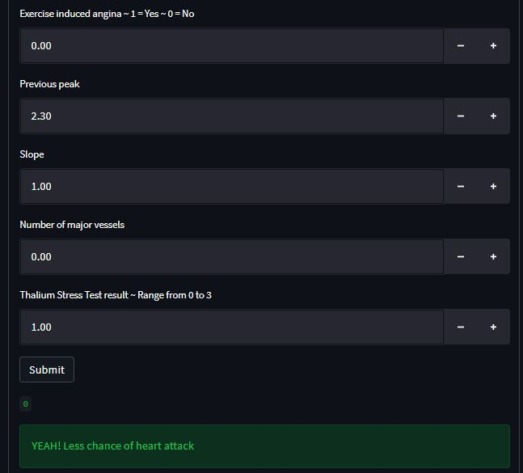

# Heart Attack Analysis and Prediction
 According to World Health Organisation (WHO), every year around 17.9 million
deaths are due to cardiovascular diseases (CVDs) predisposing CVD becoming
the leading cause of death globally. CVDs are a group of disorders of the heart
and blood vessels, if left untreated it may cause heart attack. Heart attack occurs
due to the presence of obstruction of blood flow into the heart. The presence of
blockage may be due to the accumulation of fat, cholesterol, and other substances.
Despite treatment has improved over the years and most CVD’s pathophysiology
have been elucidated, heart attack can still be fatal.

Thus, clinicians believe that prevention of heart attack is always better than curing
it. After many years of research, scientists and clinicians discovered that, the
probability of one’s getting heart attack can be determined by analysing the
patient’s age, gender, exercise induced angina, number of major vessels, chest
pain indication, resting blood pressure, cholesterol level, fasting blood sugar,
resting electrocardiographic results, and maximum heart rate achieved.

# Description

This repository contains 2 python files (train.py and deploy.py).

train.py contains the codes to extract the best machine learning model with the highest accuracy and train on Heart.csv dataset.

deploy.py contains the codes to deploy the machine learning model and launch the streamlit app.

The user can also use the Streamlit app to insert their health information.

# How to use

1. Clone this repository and use the best_model.pkl and mms_scaler.pkl (inside saved_model folder) to deploy on your dataset.
2. Another option to predict new data is by inserting input in the Streamlit app.
3. Run streamlit via conda prompt by activating the correct environment and working directory and run the code "streamlit run deploy.py".
4. Your browser will automatically redirected to streamlit local host and the streamlit app can now be launched.
5. Insert your health information and click "Submit" button to view the result.

# Performance of the model
The photo shows the accuracy score, classification report and confusion matrix of the machine leraning model.

# Streamlit Image from my browser

# Credit

Shout out to the owner of the heart dataset https://www.kaggle.com/datasets/rashikrahmanpritom/heart-attack-analysis-prediction-dataset
